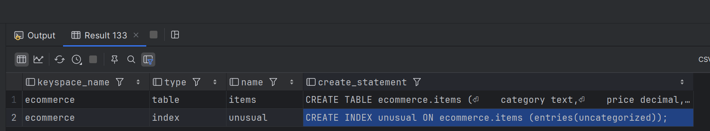
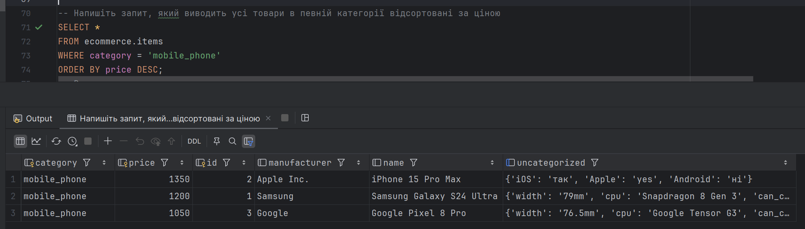
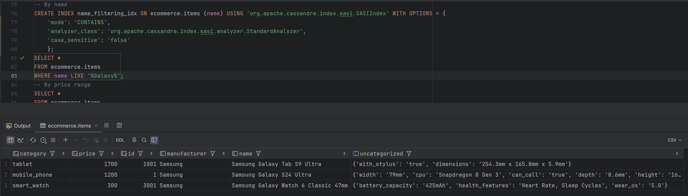
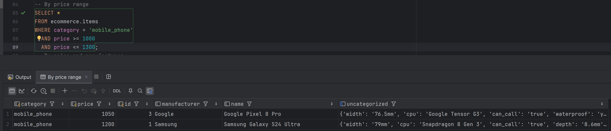
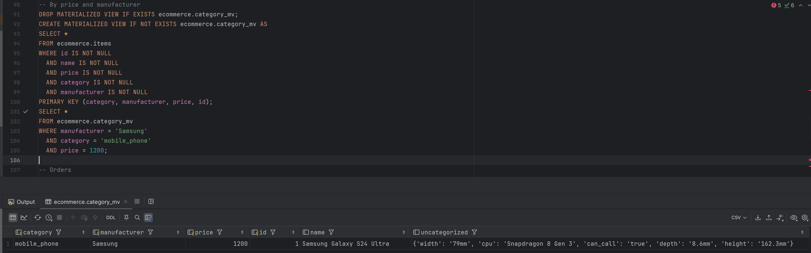
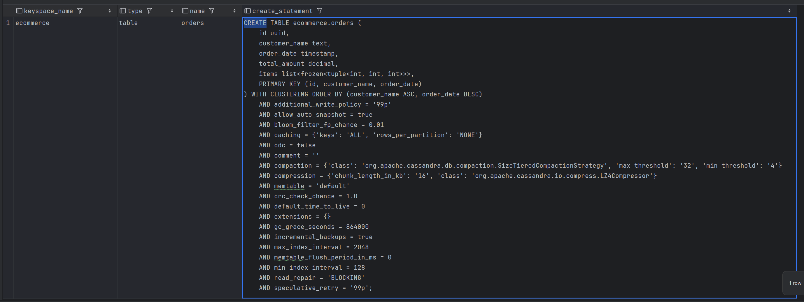
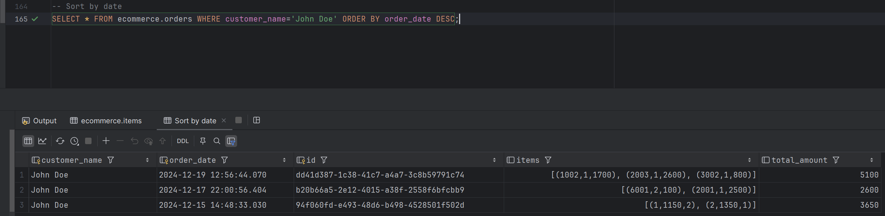
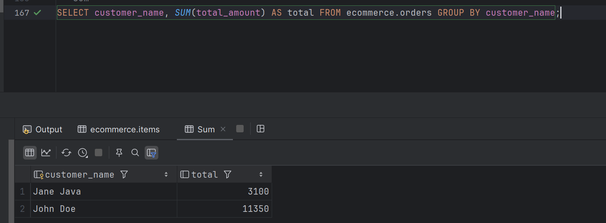
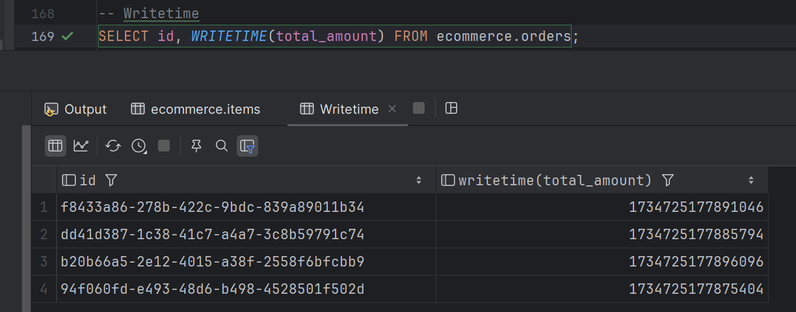

### Створення простору ключів з найпростішою стратегією реплікації
```cassandraql
CREATE KEYSPACE IF NOT EXISTS ecommerce
    WITH REPLICATION = {
        'class' : 'SimpleStrategy',
        'replication_factor' : 1
        };
```
### Створення таблиці items
```cassandraql
DROP TABLE IF EXISTS ecommerce.items;

CREATE TABLE IF NOT EXISTS ecommerce.items
(
    id            int,
    name          text,
    manufacturer  text,
    price         decimal,
    category      text,
    uncategorized map<text, text>,
    PRIMARY KEY ( category, price, id )
) WITH CLUSTERING ORDER BY (price ASC, id ASC);
```
### Створення індексу для характеристик товару, що не підлягають загальній схемі
```cassandraql
CREATE INDEX IF NOT EXISTS unusual ON ecommerce.items (ENTRIES (uncategorized));
```
### Додавання товарів
```cassandraql
INSERT INTO ecommerce.items (id, name, manufacturer, price, category, uncategorized)
VALUES (1, 'Samsung Galaxy S24 Ultra', 'Samsung', 1200, 'mobile_phone',
        {'width': '79mm', 'height': '162.3mm', 'depth': '8.6mm', 'cpu': 'Snapdragon 8 Gen 3', 'can_call': 'true'});
INSERT INTO ecommerce.items (id, name, manufacturer, price, category, uncategorized)
VALUES (2, 'iPhone 15 Pro Max', 'Apple Inc.', 1350, 'mobile_phone',
        {'Apple': 'yes', 'iOS': 'так', 'Android': 'ні'});
INSERT INTO ecommerce.items (id, name, manufacturer, price, category, uncategorized)
VALUES (3, 'Google Pixel 8 Pro', 'Google', 1050, 'mobile_phone',
        {'width': '76.5mm', 'height': '162.3mm', 'depth': '8.8mm', 'cpu': 'Google Tensor G3', 'can_call': 'true', 'waterproof': 'yes'});
INSERT INTO ecommerce.items (id, name, manufacturer, price, category, uncategorized)
VALUES (1001, 'Samsung Galaxy Tab S9 Ultra', 'Samsung', 1700, 'tablet',
        {'dimensions': '254.3mm x 165.8mm x 5.9mm', 'with_stylus': 'true'});
INSERT INTO ecommerce.items (id, name, manufacturer, price, category, uncategorized)
VALUES (1002, 'iPad Pro 12.9-inch (2024)', 'Apple Inc.', 2100, 'tablet',
        {'dimensions': '280.6mm x 214.9mm x 5.9mm', 'with_stylus': 'optional', 'display': 'Liquid Retina XDR', '5g_support': 'yes'});
INSERT INTO ecommerce.items (id, name, manufacturer, price, category, uncategorized)
VALUES (2001, 'Lenovo Legion Pro 5 16` Intel Edition', 'Lenovo', 2500, 'laptop',
        {'windows': '11', 'nvidia': '4060ti for Laptops', 'cpu_freq_max': '5.8GHz', 'cpu_freq_min': '2.2GHz', 'weight': '2200g'});
INSERT INTO ecommerce.items (id, name, manufacturer, price, category, uncategorized)
VALUES (2002, 'Dell XPS 15 9520', 'Dell', 2400, 'laptop',
        {'windows': '11', 'nvidia': 'RTX 4070', 'cpu': 'Intel i9-13900H', 'weight': '1900g', 'display': '15.6-inch OLED'});
INSERT INTO ecommerce.items (id, name, manufacturer, price, category, uncategorized)
VALUES (2003, 'ASUS ROG Zephyrus G14 (2024)', 'ASUS', 2600, 'laptop',
        {'windows': '11', 'amd': 'Ryzen 9 7940HS', 'nvidia': 'RTX 4080', 'weight': '1700g', 'display': '14-inch Mini-LED'});
INSERT INTO ecommerce.items (id, name, manufacturer, price, category, uncategorized)
VALUES (3001, 'Samsung Galaxy Watch 6 Classic 47mm', 'Samsung', 300, 'smart_watch',
        {'wear_os': '5.0', 'health_features': 'Heart Rate, Sleep Cycles', 'battery_capacity': '425mAh'});
INSERT INTO ecommerce.items (id, name, manufacturer, price, category, uncategorized)
VALUES (3002, 'Garmin Fenix 7 Solar', 'Garmin', 800, 'smart_watch',
        {'health_features': 'Heart Rate, VO2 Max, Stress Monitoring', 'battery_life': 'up to 21 days', 'solar_charging': 'true', 'gps': 'yes'});
INSERT INTO ecommerce.items (id, name, manufacturer, price, category, uncategorized)
VALUES (4001, 'Amazon Kindle Paperwhite (11th Gen)', 'Amazon', 180, 'e_reader',
        {'display': '6.8-inch E Ink', 'waterproof': 'yes', 'storage': '32GB', 'battery_life': 'up to 10 weeks', 'adjustable_warm_light': 'true'});
INSERT INTO ecommerce.items (id, name, manufacturer, price, category, uncategorized)
VALUES (5001, 'Sony WH-1000XM5', 'Sony', 400, 'headphones',
        {'noise_cancellation': 'true', 'battery_life': '30 hours', 'bluetooth_version': '5.2', 'foldable': 'true', 'weight': '250g'});
INSERT INTO ecommerce.items (id, name, manufacturer, price, category, uncategorized)
VALUES (6001, 'Logitech MX Master 3S', 'Logitech', 100, 'mouse',
        {'dpi': '8000', 'connectivity': 'Bluetooth and USB Receiver', 'battery_life': '70 days', 'ergonomic': 'yes'});
INSERT INTO ecommerce.items (id, name, manufacturer, price, category, uncategorized)
VALUES (7001, 'Bose SoundLink Flex', 'Bose', 150, 'speaker',
        {'waterproof': 'yes', 'battery_life': '12 hours', 'bluetooth_version': '5.1', 'weight': '600g', 'portable': 'true'});
INSERT INTO ecommerce.items (id, name, manufacturer, price, category, uncategorized)
VALUES (8001, 'Sony Alpha a7 IV', 'Sony', 2500, 'camera',
        {'megapixels': '33', 'lens_mount': 'E-mount', 'video_resolution': '4K', 'sensor_type': 'Full Frame', 'weight': '658g'});
```
### Додавання замовлень
```cassandraql
INSERT INTO ecommerce.orders (id, customer_name, items, order_date, total_amount)
VALUES (74bd7e98-e2b2-4a7c-99c4-b552033feb38, 'John Doe',
        [(3582e18d-3f0f-466a-8df1-2a5ede72eec0, 1150, 2), (d4893a31-7b37-4d59-8998-0b179d89bb62, 2200, 1)],
        1734698107000, 4700);
INSERT INTO ecommerce.orders (id, customer_name, items, order_date, total_amount)
VALUES (6d0890cd-417b-4a32-9f17-7dbb9cd818d3, 'Dohn Joe',
        [(fba322dd-6fcf-4f35-b340-adcbe81fedd8, 5, 6750)], 1734695107000, 6750);
```
### Запит, який показує структуру створеної таблиці
```cassandraql
DESCRIBE ecommerce.items;
```


### Напишіть запит, який виводить усі товари в певній категорії, відсортовані за ціною
```cassandraql
SELECT *
FROM ecommerce.items
WHERE category = 'mobile_phone'
ORDER BY price DESC;
```

### Напишіть запити, які вибирають товари за різними критеріями в межах певної категорії
#### Назва
```cassandraql
CREATE INDEX name_filtering_idx ON ecommerce.items (name) USING 'org.apache.cassandra.index.sasi.SASIIndex' WITH OPTIONS = {
    'mode': 'CONTAINS',
    'analyzer_class': 'org.apache.cassandra.index.sasi.analyzer.StandardAnalyzer',
    'case_sensitive': 'false'
    };
SELECT *
FROM ecommerce.items
WHERE name LIKE '%Galaxy%';
```

#### Ціна (в проміжку)
```cassandraql
SELECT *
FROM ecommerce.items
WHERE category = 'mobile_phone'
  AND price >= 1000
  AND price <= 1300;
```

#### Ціна та виробник
```cassandraql
DROP MATERIALIZED VIEW IF EXISTS ecommerce.category_mv;
CREATE MATERIALIZED VIEW IF NOT EXISTS ecommerce.category_mv AS
SELECT *
FROM ecommerce.items
WHERE id IS NOT NULL
  AND name IS NOT NULL
  AND price IS NOT NULL
  AND category IS NOT NULL
  AND manufacturer IS NOT NULL
PRIMARY KEY (category, manufacturer, price, id);

SELECT *
FROM ecommerce.category_mv
WHERE manufacturer = 'Samsung'
  AND category = 'mobile_phone'
  AND price = 1200;
```


### Створення таблиці замовлень
```cassandraql
DROP TABLE IF EXISTS ecommerce.orders;

CREATE TABLE IF NOT EXISTS ecommerce.orders
(
    id            uuid,
    customer_name text,
    order_date    timestamp,
    items         list<tuple<int, int, int>>,
    total_amount  decimal,
    PRIMARY KEY ( id, customer_name, order_date )
) WITH CLUSTERING ORDER BY (customer_name ASC, order_date DESC);
```
### Наповнення таблиці
```cassandraql
INSERT INTO ecommerce.orders (id, customer_name, items, order_date, total_amount)
VALUES (uuid(), 'John Doe',
        [
            (1, 1150, 2), -- bought x2 {S24 Ultra} with a 50$ discount per unit
            (2, 1350, 1) -- x1 iPhone
            ],
        1734274113030, 3650);
INSERT INTO ecommerce.orders (id, customer_name, items, order_date, total_amount)
VALUES (uuid(), 'John Doe',
        [
            (1002, 1, 1700), -- x1 iPad
            (2003, 1, 2600), -- x1 laptop
            (3002, 1, 800) -- x1 smartwatch
            ],
        1734613004070, 5100);
INSERT INTO ecommerce.orders (id, customer_name, items, order_date, total_amount)
VALUES (uuid(), 'Jane Java',
        [
            (7001, 2, 300), -- x2 speakers
            (8001, 1, 2500) -- x1 camera
            ],
        1734137734765, 3100);
INSERT INTO ecommerce.orders (id, customer_name, items, order_date, total_amount)
VALUES (uuid(), 'John Doe',
        [
            (6001, 2, 100), -- x1 mouse
            (2001, 1, 2500) -- x1 laptop
            ],
        1734472856404, 2600);
```
### Напишіть запит, який показує структуру створеної таблиці 
```cassandraql
DESCRIBE ecommerce.orders;
```

## TODO describe
### Для замовника виведіть всі його замовлення відсортовані за часом коли вони були зроблені
```cassandraql
SELECT * FROM ecommerce.orders WHERE customer_name='John Doe' ORDER BY order_date DESC;
```

### Для кожного замовника визначте суму на яку були зроблені усі його замовлення
```cassandraql
SELECT customer_name, SUM(total_amount) AS total FROM ecommerce.orders GROUP BY customer_name;
```

### Для кожного замовлення виведіть час коли його ціна була занесена в базу
```cassandraql
SELECT id, WRITETIME(total_amount) FROM ecommerce.orders;
```
