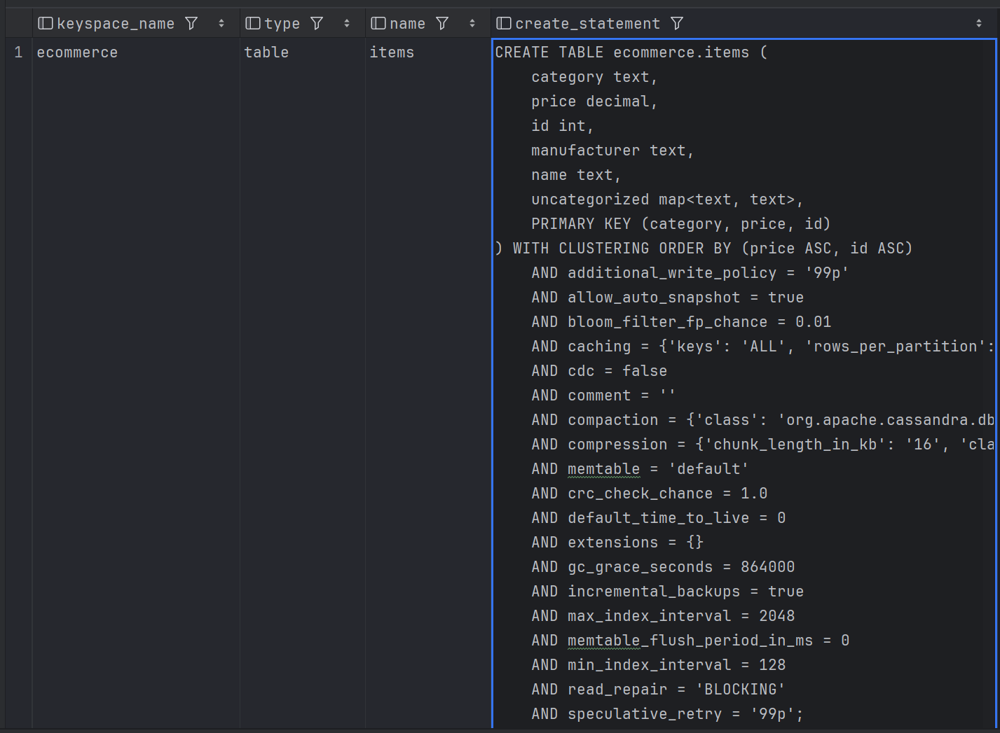

### Знайти Items які входять в конкретний Order

### Підрахувати вартість конкретного Order

### Знайти всі Orders конкретного Customer + Знайти всі Items куплені конкретним Customer (через Order)

### Знайти кількість Items куплені конкретним Customer (через Order)

### Знайти для Customer на яку суму він придбав товарів (через Order)

### Знайти скільки разів кожен товар був придбаний, відсортувати за цим значенням

### Знайти всі Items переглянуті (view) конкретним Customer

### Знайти інші Items що купувались разом з конкретним Item (тобто всі Items що входять до Order-s разом з даними Item)

### Знайти Customers які купили даний конкретний Item

### Знайти для певного Customer(а) товари, які він переглядав, але не купив

### Як і в попередніх завданнях, для якогось одного обраного Item додайте поле з кількістю його лайків.
| Instance # | Time elapsed |
|------------|--------------|
| hz-1       | 155.05s      |
| hz-2       | 156.43s      |
| hz-3       | 155.96s      |
| hz-4       | 155.67s      |
| hz-5       | 156.57s      |
| hz-6       | 155.36s      |
| hz-7       | 155.29s      |
| hz-8       | 155.71s      |
| hz-9       | 155.49s      |
| hz-10      | 155.84s      |
| Avg        | 155.74s      | 
### Фінальне значення лічильника
