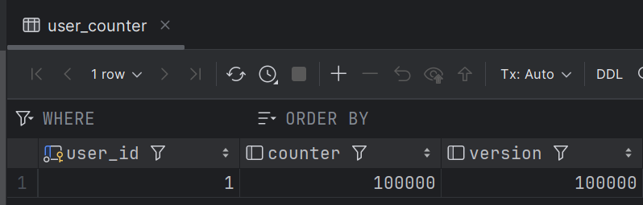

# Використання
```shell
# ./mvnw clean package
mvn clean package
docker compose build --no-cache
docker compose up -d
```
Після запуску команд збереться кластер з 10-ти інстансів одного і того ж застосунку, та бази даних Postgres, та автоматично запуститься процес бенчмарку всіх чотирьох варіацій задачі.
__Бібліотека Hazelcast використовувалася виключно для синхронізації стану бази даних між кожним заміром алгоритмів із завдання.__
# Результати
На скриншоті показаний типовий час виконання кожного типу завданої задачі

Статистика витраченого часу по всім інстансам по кожній задачі (в мілісекундах):

### Lost update:

| Stat           |    Value |
|:---------------|---------:|
| Avg            |  68330.3 |
| Count          |       10 |
| Median         |  68504.5 |
| Geometric Mean | 68328.88 |
| Largest        |    68663 |
| Smallest       |    67086 |
| Range          |     1577 |

### In-place update:

| Stat           |    Value |
|:---------------|---------:|
| Avg            |  65944.9 |
| Count          |       10 |
| Median         |  65955.5 |
| Geometric Mean | 65944.35 |
| Largest        |    66291 |
| Smallest       |    65306 |
| Range          |      985 |

### Row-level locking:

| Stat           |    Value |
|:---------------|---------:|
| Avg            |  72037.6 |
| Count          |       10 |
| Median         |  72117.5 |
| Geometric Mean | 72037.30 |
| Largest        |    72227 |
| Smallest       |    71538 |
| Range          |      689 |

### Optimistic concurrency control:

| Stat           |     Value |
|:---------------|----------:|
| Avg            |  429492.8 |
| Count          |        10 |
| Median         |  458840.5 |
| Geometric Mean | 425186.85 |
| Largest        |    488511 |
| Smallest       |    334461 |
| Range          |    154050 |

В результаті оновлень колонка version отримала таке саме значення, як і counter


# Висновки
Найповільніший метод синхронізації - optimistic concurrency control. Також має найбільшу варіанту витраченого часу.

Найшвидший - In-place update, що навіть відпрацював швидше за lost update, в якому немає консистетності даних

| Algorithm                      | Time consumed, x(In-place) |
|:-------------------------------|---------------------------:|
| In-place update                |                         1x |
| Lost update                    |                     1.036x |
| Row-level locking              |                      1.09x |
| Optimistic concurrency control |                      6.51x |

### Примітка: попередня версія звіту (можна подивитись в історії комітів) була зроблена по коду з багом, що спричиняв мережевий ботл-нек, і що цікаво, алгоритм Optimistic concurrency control не мав таку варіанту значень по інстансах