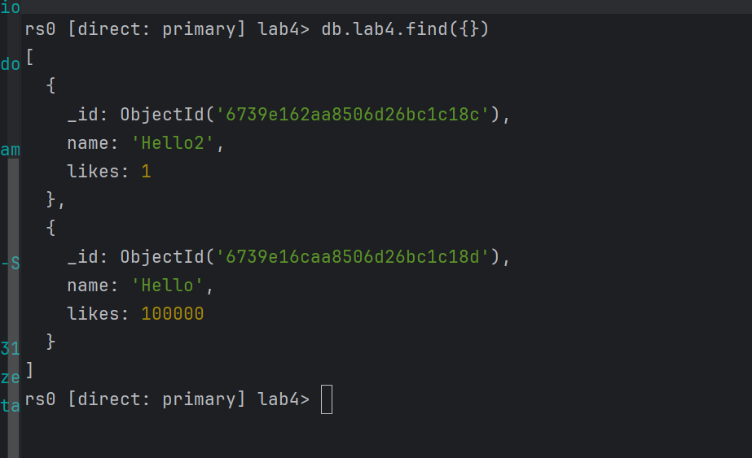

### Налаштувати реплікацію в конфігурації: Primary with Two Secondary Members (P-S-S)
```shell
rs.initiate({_id:"rs0",members:[{_id:0,host:"mongo-1"},{_id:1,host:"mongo-2"},{_id:2,host:"mongo-3"}]})
```

```shell
rs0 [direct: primary] test> rs.status()
{
  set: 'rs0',
  date: ISODate('2024-11-16T18:26:57.238Z'),
  myState: 1,
  term: Long('1'),
  syncSourceHost: '',
  syncSourceId: -1,
  heartbeatIntervalMillis: Long('2000'),
  majorityVoteCount: 2,
  writeMajorityCount: 2,
  votingMembersCount: 3,
  writableVotingMembersCount: 3,
  optimes: {
    lastCommittedOpTime: { ts: Timestamp({ t: 1731781611, i: 1 }), t: Long('1') },
    lastCommittedWallTime: ISODate('2024-11-16T18:26:51.775Z'),
    readConcernMajorityOpTime: { ts: Timestamp({ t: 1731781611, i: 1 }), t: Long('1') },
    appliedOpTime: { ts: Timestamp({ t: 1731781611, i: 1 }), t: Long('1') },
    durableOpTime: { ts: Timestamp({ t: 1731781611, i: 1 }), t: Long('1') },
    writtenOpTime: { ts: Timestamp({ t: 1731781611, i: 1 }), t: Long('1') },
    lastAppliedWallTime: ISODate('2024-11-16T18:26:51.775Z'),
    lastDurableWallTime: ISODate('2024-11-16T18:26:51.775Z'),
    lastWrittenWallTime: ISODate('2024-11-16T18:26:51.775Z')
  },
  lastStableRecoveryTimestamp: Timestamp({ t: 1731781561, i: 1 }),
  electionCandidateMetrics: {
    lastElectionReason: 'electionTimeout',
    lastElectionDate: ISODate('2024-11-16T18:08:21.742Z'),
    electionTerm: Long('1'),
    lastCommittedOpTimeAtElection: { ts: Timestamp({ t: 1731780491, i: 1 }), t: Long('-1') },
    lastSeenWrittenOpTimeAtElection: { ts: Timestamp({ t: 1731780491, i: 1 }), t: Long('-1') },
    lastSeenOpTimeAtElection: { ts: Timestamp({ t: 1731780491, i: 1 }), t: Long('-1') },
    numVotesNeeded: 2,
    priorityAtElection: 1,
    electionTimeoutMillis: Long('10000'),
    numCatchUpOps: Long('0'),
    newTermStartDate: ISODate('2024-11-16T18:08:21.775Z'),
    wMajorityWriteAvailabilityDate: ISODate('2024-11-16T18:08:22.261Z')
  },
  members: [
    {
      _id: 0,
      name: 'mongo-1:27017',
      health: 1,
      state: 1,
      stateStr: 'PRIMARY',
      uptime: 1392,
      optime: { ts: Timestamp({ t: 1731781611, i: 1 }), t: Long('1') },
      optimeDate: ISODate('2024-11-16T18:26:51.000Z'),
      optimeWritten: { ts: Timestamp({ t: 1731781611, i: 1 }), t: Long('1') },
      optimeWrittenDate: ISODate('2024-11-16T18:26:51.000Z'),
      lastAppliedWallTime: ISODate('2024-11-16T18:26:51.775Z'),
      lastDurableWallTime: ISODate('2024-11-16T18:26:51.775Z'),
      lastWrittenWallTime: ISODate('2024-11-16T18:26:51.775Z'),
      syncSourceHost: '',
      syncSourceId: -1,
      infoMessage: '',
      electionTime: Timestamp({ t: 1731780501, i: 1 }),
      electionDate: ISODate('2024-11-16T18:08:21.000Z'),
      configVersion: 1,
      configTerm: 1,
      self: true,
      lastHeartbeatMessage: ''
    },
    {
      _id: 1,
      name: 'mongo-2:27017',
      health: 1,
      state: 2,
      stateStr: 'SECONDARY',
      uptime: 1125,
      optime: { ts: Timestamp({ t: 1731781611, i: 1 }), t: Long('1') },
      optimeDurable: { ts: Timestamp({ t: 1731781611, i: 1 }), t: Long('1') },
      optimeWritten: { ts: Timestamp({ t: 1731781611, i: 1 }), t: Long('1') },
      optimeDate: ISODate('2024-11-16T18:26:51.000Z'),
      optimeDurableDate: ISODate('2024-11-16T18:26:51.000Z'),
      optimeWrittenDate: ISODate('2024-11-16T18:26:51.000Z'),
      lastAppliedWallTime: ISODate('2024-11-16T18:26:51.775Z'),
      lastDurableWallTime: ISODate('2024-11-16T18:26:51.775Z'),
      lastWrittenWallTime: ISODate('2024-11-16T18:26:51.775Z'),
      lastHeartbeat: ISODate('2024-11-16T18:26:55.754Z'),
      lastHeartbeatRecv: ISODate('2024-11-16T18:26:56.755Z'),
      pingMs: Long('0'),
      lastHeartbeatMessage: '',
      syncSourceHost: 'mongo-1:27017',
      syncSourceId: 0,
      infoMessage: '',
      configVersion: 1,
      configTerm: 1
    },
    {
      _id: 2,
      name: 'mongo-3:27017',
      health: 1,
      state: 2,
      stateStr: 'SECONDARY',
      uptime: 1125,
      optime: { ts: Timestamp({ t: 1731781611, i: 1 }), t: Long('1') },
      optimeDurable: { ts: Timestamp({ t: 1731781611, i: 1 }), t: Long('1') },
      optimeWritten: { ts: Timestamp({ t: 1731781611, i: 1 }), t: Long('1') },
      optimeDate: ISODate('2024-11-16T18:26:51.000Z'),
      optimeDurableDate: ISODate('2024-11-16T18:26:51.000Z'),
      optimeWrittenDate: ISODate('2024-11-16T18:26:51.000Z'),
      lastAppliedWallTime: ISODate('2024-11-16T18:26:51.775Z'),
      lastDurableWallTime: ISODate('2024-11-16T18:26:51.775Z'),
      lastWrittenWallTime: ISODate('2024-11-16T18:26:51.775Z'),
      lastHeartbeat: ISODate('2024-11-16T18:26:55.755Z'),
      lastHeartbeatRecv: ISODate('2024-11-16T18:26:56.754Z'),
      pingMs: Long('0'),
      lastHeartbeatMessage: '',
      syncSourceHost: 'mongo-1:27017',
      syncSourceId: 0,
      infoMessage: '',
      configVersion: 1,
      configTerm: 1
    }
  ],
  ok: 1,
  '$clusterTime': {
    clusterTime: Timestamp({ t: 1731781611, i: 1 }),
    signature: {
      hash: Binary.createFromBase64('AAAAAAAAAAAAAAAAAAAAAAAAAAA=', 0),
      keyId: Long('0')
    }
  },
  operationTime: Timestamp({ t: 1731781611, i: 1 })
}
```
### Спробувати зробити запис з однією відключеною нодою та write concern рівним 3 та нескінченним таймаутом. Спробувати під час таймаута включити відключену ноду 

Запис не зробиться, доки не буде увімкнена 3-тя нода

### Аналогічно попередньому пункту, але задати скінченний таймаут та дочекатись його закінчення.
```shell
rs0 [direct: primary] test> db.lab4.insertOne({name:"Hello2"},{writeConcern:{w:3,wtimeout:3000}})
Uncaught:
MongoWriteConcernError[WriteConcernFailed]: waiting for replication timed out
Additional information: {
  wtimeout: true,
  writeConcern: { w: 3, wtimeout: 3000, provenance: 'clientSupplied' }
}
Result: {
  n: 1,
  electionId: ObjectId('7fffffff0000000000000001'),
  opTime: { ts: Timestamp({ t: 1731789581, i: 1 }), t: Long('1') },
  writeConcernError: {
    code: 64,
    codeName: 'WriteConcernFailed',
    errmsg: 'waiting for replication timed out',
    errInfo: {
      wtimeout: true,
      writeConcern: { w: 3, wtimeout: 3000, provenance: 'clientSupplied' }
    }
  },
  ok: 1,
  '$clusterTime': {
    clusterTime: Timestamp({ t: 1731789581, i: 1 }),
    signature: {
      hash: Binary.createFromBase64('AAAAAAAAAAAAAAAAAAAAAAAAAAA=', 0),
      keyId: Long('0')
    }
  },
  operationTime: Timestamp({ t: 1731789581, i: 1 })
}
```
Запис відбувся, але тільки на primary ноді
```shell
rs0 [direct: primary] test> db.lab4.find({name:"Hello2"}, {readConcern: {level: "majority"}})
[
  {
    _id: ObjectId('6739030da7f52d6164c1c18d'),
    readConcern: { level: 'majority' }
  }
]
```
```shell
rs0 [direct: primary] test> rs.printSecondaryReplicationInfo()
source: mongo-2:27017
{
  syncedTo: 'Sat Nov 16 2024 20:58:46 GMT+0000 (Coordinated Universal Time)',
  replLag: '0 secs (0 hrs) behind the primary '
}
---
source: mongo-3:27017
{ 'no replication info, yet.  State': '(not reachable/healthy)' }
```


### Продемонструйте перевибори primary node, відключивши поточний primary node


### W1 + majority: вимірювання часу
#### W1: 22 seconds avg
 
#### Majority: 38.7 seconds avg

### Повторно запустіть код при writeConcern = 1, але тепер під час роботи відключіть Primary ноду і подивитись що буде обрана інша Primary нода, яка продовжить обробку запитів, і чи кінцевий результат буде коректним.
Під час записів с 10 нод, була призупинена primary нода MongoDB. Втрачається деяка кількість операцій інкременту
#### Time avg: 32.7s

### Повторно запустіть код при writeConcern = majority, але тепер під час роботи відключіть Primary ноду і подивитись що буде обрана інша Primary нода, яка продовжить обробку запитів, і чи кінцевий результат буде коректним.
Втрат при запису немає

#### Time avg: 51.02s