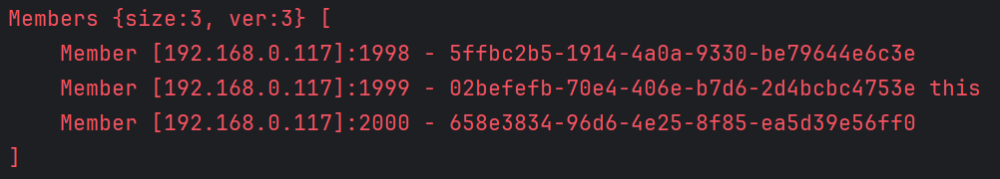

### 2. Сконфігурувати і запустити 3 ноди (інстанси) об'єднані в кластер або як частину Java-застосування, або як окремі застосування

### 4. На основі прикладу https://docs.hazelcast.com/imdg/latest/data-structures/map#locking-maps реалізуйте каунтер без блокувань. Поміряйте час виконання, та подивиться чи коректне кінцеве значення каунтера ви отримаєте.

### 5. На основі прикладу https://docs.hazelcast.com/imdg/latest/data-structures/map#pessimistic-locking  реалізуйте каунтер з використанням песимістичного блокування. Поміряйте час виконання, та подивиться чи коректне кінцеве значення каунтера ви отримаєте.

### 6. На основі прикладу https://docs.hazelcast.com/imdg/latest/data-structures/map#optimistic-locking  реалізуйте каунтер з використанням оптимістичного блокування. Поміряйте час виконання, та подивиться чи коректне кінцеве значення каунтера ви отримаєте.

### 7. Реалізуйте каунтер з використанням IAtomicLong та увімкнувши підтимку CP Sysbsystem (https://docs.hazelcast.com/hazelcast/5.4/cp-subsystem/configuration) на основі трьох нод. Поміряйте час виконання, та подивиться чи коректне кінцеве значення каунтера ви отримаєте.

### Приведно лог, який видають ноди Hazelcast, де буде видно що кластер складається з 3-х нод і що активована CP Subsystem 
